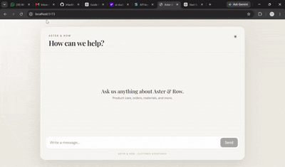
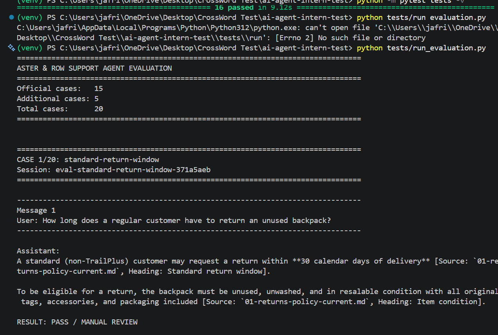
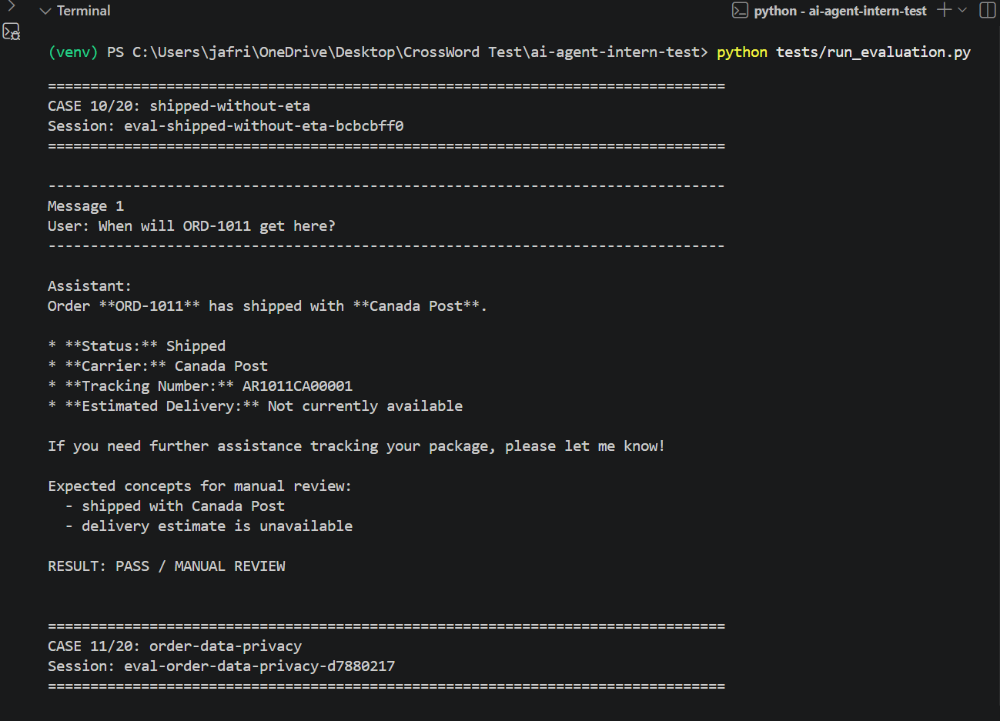
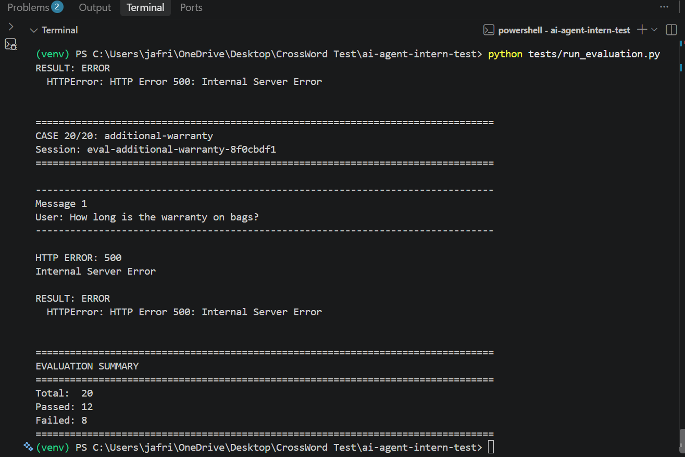
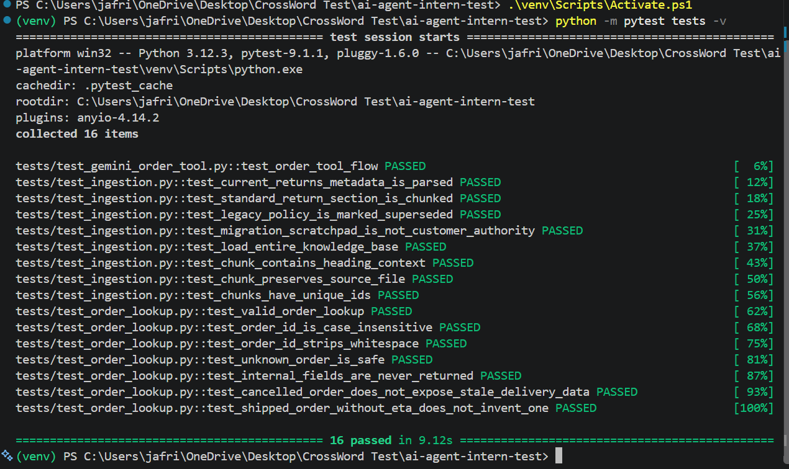

## Demo

Recommended
[▶️ Watch the Aster & Row Chat Demo on Youtube](https://youtu.be/StMYQiSUpMs)




## Setup

Follow the steps below to set up and run the project locally.

### 1. Clone the Repository

```bash
git clone <repository-url>
cd <repository-directory>
```

### 2. Create a Virtual Environment

```bash
python -m venv venv
```

Activate the virtual environment.

**Windows:**

```bash
venv\Scripts\activate
```

**macOS / Linux:**

```bash
source venv/bin/activate
```

### 3. Install Requirements

```bash
pip install -r requirements.txt
```

### 4. Configure Environment Variables
Used
GENERATION_MODEL="gemini-3.6-flash"
EMBEDDING_MODEL="gemini-embedding-2"

Create a `.env` file in the **root directory** of the project:

```env
GEMINI_API_KEY=enter_your_api_key_here
```

* `GEMINI_API_KEY` — Your Gemini API key.
* `GENERATION_MODEL` — Gemini model used for generating responses.
* `EMBEDDING_MODEL` — Gemini model used for generating document embeddings.

> **Note:** Never commit your `.env` file to version control. Add it to `.gitignore`.

### 5. Build the Document Index

A simple indexing script is provided to process the documents and generate their embeddings.

Run the script **once**:

```bash
python scripts/build_index.py
```

The script creates the following files inside the `artifact/` directory:

```text
artifact/
├── chunk.json
└── index.faiss
```

* `chunk.json` — Stores the document chunks and their associated metadata.
* `index.faiss` — Stores the vector embeddings used for similarity search.

Once these files have been generated, the application can use them for document retrieval.

---

## Frontend Setup

Navigate to the frontend directory:

```bash
cd aster-row-chat
```

Initialize the Node.js project:

```bash
npm init
```

Install the dependencies:

```bash
npm install
```

Start the development server:

```bash
npm run dev
```

The frontend will then be available at the local development URL shown in the terminal.

---

## Architecture

The application follows a **RAG-based support-agent architecture**.

```text
User / Frontend
      │
      ▼
 Backend API
      │
      ▼
 Support Agent
   ┌──┴───────────────┐
   │                  │
   ▼                  ▼
Retriever        Order Lookup
   │                  │
   ▼                  ▼
FAISS Vector      orders.json
Store
   │
   ▼
Metadata + Reranker
   │
   ▼
Context Selection
   │
   └──────────┐
              ▼
        Gemini Client
              │
              ▼
       Final Response
              │
              ▼
        User / Frontend
```

### How It Works

1. The **frontend** sends the user's message and recent conversation history to the backend.
2. The **Support Agent** determines whether the request requires knowledge-base retrieval or an order lookup.
3. For knowledge-base questions, the **Retriever** searches the FAISS vector store and applies metadata/reranking to select relevant chunks.
4. For order-related questions, the agent retrieves information from the sanitized `orders.json` data.
5. The selected context, conversation history, and user message are sent to the **Gemini generation model**.
6. Gemini generates the final response, including citations or a handoff when necessary.
7. The response is returned to the frontend and displayed to the user.

### Models

| Purpose             | Model                |
| ------------------- | -------------------- |
| Response Generation | `gemini-3.6-flash`   |
| Document Embeddings | `gemini-embedding-2` |

### Document Indexing Flow

```text
Documents
    │
    ▼
Chunking
    │
    ▼
Gemini Embedding Model
    │
    ▼
Vector Embeddings
    │
    ├──────────────► chunk.json
    │
    └──────────────► index.faiss
```

The indexing script only needs to be run when the source documents are added or updated.
## Evaluation Suite

The evaluation suite is implemented in `tests/run_evaluation.py`. It runs behavior-level evaluation cases and checks the agent against expected outcomes such as retrieval quality, grounding, tool usage, privacy, multi-turn behavior, and safe handoff.

> **Note:** Limit is hit due to the free tier of the Gemini API(thats why only 12/20 is passed for others rate limit occurred).







### Running the Evaluation
```bash
python tests/run_evaluation.py
```

Deterministic Regression Tests
For the full deterministic regression suite, run:
Run the behavior-level evaluation with:


```bash
python -m pytest tests -v
```


## Bug Diary

### 1. Superseded or Conflicting Policies Ranked Incorrectly

**Issue**

Initial retrieval relied too heavily on semantic similarity. As a result, legacy and current documents, as well as unrelated policy chunks, could receive similar rankings.

**Resolution**

Added metadata-aware reranking using:

* Document status
* Document authority
* Supersession metadata

A context diversity selection step was also added to ensure the final context contains relevant and non-redundant information.

---

### 2. Gemini Tool Call Failed with `Role 'tool' is not supported`

**Issue**

The Gemini SDK/API did not accept `types.Content(role="tool")` when manually constructing the follow-up conversation after a tool call.

**Resolution**

Changed the function-response message to use the supported `user` role while preserving the model's tool-call response and the corresponding function result.

---

### 3. Multi-Turn Follow-Ups Lost Context

**Issue**

Each request was effectively treated as an independent query. As a result, follow-up questions such as:

> "What about Canada?"

or:

> "When will it arrive?"

could lack the context required to produce a consistent answer.

**Resolution**

Added bounded conversation history to each request.

The system now:

* Includes recent conversation history for conversational context.
* Keeps retrieval focused on the current user query.
* Uses conversation history to resolve references and follow-up questions.
* Limits the amount of history passed to the model to avoid unnecessary context growth.


## Known Limitations

### 1. Conversation History Is Stored in a Shared CSV

The current implementation stores conversation queries and responses in a simple CSV file. This is sufficient for a single-user or demo environment, but a shared conversation store is not suitable for multiple concurrent users because conversations may become mixed or introduce race conditions.

**Improvement:** Before production, replace the CSV with a database-backed conversation store using a unique `session_id` or `user_id`, with each conversation persisted separately.

---

### 2. History Uses a Fixed Last-5-Turn Window

The agent currently sends the five most recent conversation turns to Gemini. This keeps the context size bounded, but relevant information from older turns may be lost. Conversely, recent turns may be unrelated to the current question and introduce unnecessary context.

**Improvement:** Add history relevance filtering or retrieval so that only conversation turns relevant to the current query are included, while retaining a small amount of recent context for conversational continuity.


## AI Coding Tools Used

### ChatGPT

I used ChatGPT primarily for implementation guidance, debugging, and architecture discussions while building the agent.

#### 1. Gemini API Integration

An initial code suggestion used an older or incompatible version of the Gemini SDK, which caused runtime errors during function/tool calling.

I identified the mismatch and referred to the current official Gemini SDK documentation to correct the implementation and ensure compatibility with the API.

#### 2. Storage Architecture

ChatGPT initially suggested using a database for both vector embeddings and conversation history. Given the **6–8 hour assignment timebox** and the relatively small dataset, I chose a simpler approach:

* **FAISS** — Used for local vector similarity search and embedding storage.
* **CSV-based conversation history** — Used for storing conversation history in the current prototype.

This approach reduced implementation complexity while still allowing the core **RAG, tool-calling, and multi-turn conversation** behavior to be demonstrated effectively.


